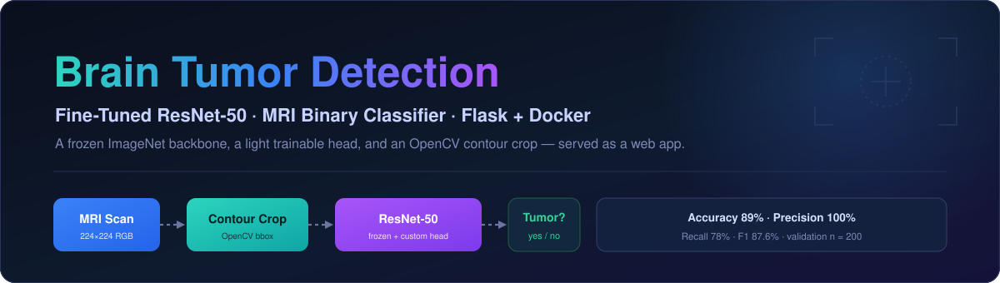

<div align="center">



<br/>

### A web app that looks at a brain MRI and answers one question — *is there a tumor?* — with a confidence number and the honesty to tell you what it still gets wrong.

A ResNet-50 pretrained on ImageNet, frozen, with a small custom head trained on MRI scans. An OpenCV step crops each scan down to just the brain before the network ever sees it. The whole thing ships as a Flask app in a Docker container.

<br/>

[]([#run-the-web-app](https://huggingface.co/spaces/satyam2025/Brain-Tumor-Detection-MRI))
&nbsp;

<br/>


</div>

---

## What this is

Two MRI scans, same question: *tumor, or not?* Drop one into the app and it gives you a verdict — **yes** or **no** — plus how confident it is and the probability it assigned to each class. There's no four-class staging here, no segmentation mask; it does one binary call and does it deliberately.

The interesting part isn't the ResNet — transfer learning on ImageNet is a well-worn path. It's the two decisions around it:

- **Crop the brain before classifying.** A raw MRI is mostly black border. An OpenCV contour step finds the brain and throws the rest away, so the network spends its attention on tissue, not padding.
- **Freeze almost everything.** With only ~2,800 training images, fine-tuning all 25M ResNet weights would overfit fast. So the convolutional backbone stays frozen and only a ~1.5M-parameter head learns the MRI-specific decision.

---

## The pipeline

```mermaid
flowchart LR
    IMG[MRI scan<br/>any size] --> CROP[Brain contour crop<br/>OpenCV bounding box]
    CROP --> PREP[Resize 224&#215;224<br/>ImageNet normalise]
    PREP --> BB[ResNet-50 backbone<br/>frozen &#183; ImageNet-V2]

    subgraph HEAD [Trainable head &#183; ~1.5M params]
      direction TB
      D1[Dropout 0.4] --> L1[Linear 2048 &#8594; 728] --> R[ReLU] --> D2[Dropout 0.4] --> L2[Linear 728 &#8594; 2]
    end

    BB --> HEAD
    HEAD --> SM[softmax] --> OUT([no / yes<br/>+ confidence])

    classDef frozen fill:#1E293B,stroke:#475569,color:#cbd5e1;
    classDef head fill:#7C3AED,stroke:#306,color:#fff;
    classDef out fill:#2EA043,stroke:#063,color:#fff;
    class BB frozen;
    class HEAD head;
    class OUT out;
```



### Why crop the brain first?

A skull MRI arrives with a big black frame around it, and that frame is noise — it varies by scanner, by slice, by patient, and tells you nothing about tumors. So before anything else, [`crop_brain_contour`](app.py) runs a small classical-CV routine:

1. Grayscale → Gaussian blur → binary threshold at 45.
2. Erode then dilate to clean up specks.
3. Take the **largest external contour** — that's the brain — and crop to its bounding box (plus a 2px margin).

Only then does the image get resized to `224×224` and normalised with ImageNet statistics. The exact same crop runs at training time *and* at inference time inside the Flask app, so there's no train/serve skew.

---

## The model

| Component | Choice |
|---|---|
| Backbone | `torchvision.models.resnet50`, **ImageNet1K-V2** weights, **frozen** |
| Head | `Dropout(0.4)` → `Linear(2048→728)` → `ReLU` → `Dropout(0.4)` → `Linear(728→2)` |
| Total params | ~25.0M |
| **Trainable params** | **~1.49M** (the head only) |
| Loss | `CrossEntropyLoss` |
| Optimiser | `Adam` on the head, `lr = 1e-4`, `weight_decay = 1e-4` |
| LR schedule | `ReduceLROnPlateau(mode="max", factor=0.5, patience=2)` |
| Regularisation | two dropout layers + early stopping (patience 10) |

The frozen backbone is doing the heavy lifting — it already knows edges, textures, and shapes from 1.2M ImageNet images. The head just learns to read those features as "tumor" or "not."

### Training setup

| Knob | Value |
|---|:---:|
| Dataset | BRATS-2019 (train / valid), via `kagglehub` |
| Train / val images | 2,800 / 200 |
| Input size | 224 × 224 |
| Batch size | 64 |
| Max epochs | 25 (early-stopped at **22**) |
| Augmentation (train) | H-flip 0.5 · V-flip 0.3 · rotate ±20° · colour jitter 0.2 |
| Seed | 42 |

---

## Did it work? The numbers

Training ran for 22 epochs before early stopping, with the best validation accuracy — **89%** — landing at epoch 12. The `ReduceLROnPlateau` scheduler stepped the learning rate down four times (`1e-4 → 5e-5 → 2.5e-5 → 1.25e-5 → …`) as validation accuracy plateaued, which is exactly the late-training fine-tuning behaviour you want to see.

| Metric (tumor class) | Value | What it means |
|---|:---:|---|
| Validation accuracy | **89.0%** | overall, on 200 scans |
| Precision | **100.0%** | never false-alarms on a healthy scan |
| **Recall** | **78.0%** | ⚠️ **misses ~1 in 5 real tumors — the flaw that matters most** |
| F1-score | **87.6%** | precision/recall balance |

On the 200-image validation set, that breaks down as:

```
                  Predicted: no    Predicted: yes
   Actual: no          100               0          ← zero false alarms
   Actual: yes          22              78          ← 22 tumors missed
```

### The major flaw — recall is the number that matters, and it's the weak one

> ⚠️ **The model misses about 1 in 5 real tumors (recall = 78%).** For a screening tool whose entire job is to *not miss* disease, this — not the 89% accuracy, not the 100% precision — is the headline. A **false negative** (a real tumor reported as "no") is the most costly mistake this model can make, and it makes it **22% of the time**.

That **100% precision** looks great, and in one sense it is: the model never once cried wolf — not a single healthy scan was flagged as a tumor. But precision is the *cheap* win here. **Recall is what counts.** Those **22 false negatives** in the confusion matrix above — 22 patients with a tumor told "no" — are exactly the cases a diagnostic aid must never get wrong, and they're why the honest takeaway from this project is its weakest metric, not its strongest.

So this is an honest 89%, not a cherry-picked one. The path to better recall is clear — a decision threshold shifted toward the tumor class, a recall-weighted (or focal) loss, more and harder tumor examples, and a validation set far bigger than 200 — and that's the direction the project points next, rather than pretending the headline accuracy is the whole story.

---

## Run the web app

The repo ships a Flask UI: upload an MRI, or click one of the bundled sample scans, and get a verdict with confidence and per-class probabilities.

```bash
pip install -r requirements.txt
python app.py            # serves on http://localhost:5000
```

> **Note on the weights.** The trained `best_brain_tumor_model.pth` (~96 MB) is **not** committed here — model binaries don't belong in git. Train it yourself with the notebook (it saves to that path), or drop your own `.pth` in the project root before launching. Without it, the app starts but inference won't run.

### In a container

```bash
docker build -t brain-tumor-detection .
docker run -p 7860:7860 brain-tumor-detection      # http://localhost:7860
```

The [`Dockerfile`](Dockerfile) uses CPU-only PyTorch wheels to keep the image lean and targets port `7860`, so it deploys to **Hugging Face Spaces** as-is. [`deploy_to_hf.py`](deploy_to_hf.py) pushes the app there — set your own `HF_TOKEN` in a local `.env` (which is git-ignored) and your own username/space name first.

---

## Reproduce the training

Everything is in [`medical-image.ipynb`](medical-image.ipynb) (committed with outputs stripped to keep it light). It downloads the BRATS-2019 set via `kagglehub`, builds the augmentation pipeline, trains the head, and produces the full visual suite: sample batch, class distribution, loss/accuracy curves, a performance dashboard, the confusion matrix, a prediction gallery, and a step-by-step contour-crop demo.

```bash
pip install torch torchvision matplotlib seaborn scikit-learn tqdm opencv-python pillow kagglehub
# then run medical-image.ipynb top to bottom
```

---

## Where things live

```
.
├── app.py                 Flask app: contour crop + ResNet-50 inference, upload / sample-image UI
├── medical-image.ipynb    training notebook (data → augment → train head → evaluate → visualise)
├── deploy_to_hf.py         push the app to a Hugging Face Docker Space
├── Dockerfile              CPU-only PyTorch image, port 7860
├── requirements.txt        runtime deps (Flask, torch, torchvision, opencv, pillow, numpy)
├── templates/index.html    the web UI
├── default_images/         six bundled sample MRIs to try in the app
└── assets/banner.svg
```

Not in the repo, on purpose: the `.env` (HF token), `best_brain_tumor_model.pth` (~96 MB weights), the `dataset/` (pulled via `kagglehub`), and the `uploads/` scratch folder.

---

## A word of caution

This is a learning and research project, not a medical device. It's trained on a small public dataset, it misses about a fifth of tumors, and it should never be used to make a real diagnosis. Read it as a clean, end-to-end example of transfer learning plus classical CV preprocessing, deployed properly — nothing more.

<div align="center">

**If this was a useful read or reference, a star goes a long way.**

</div>
